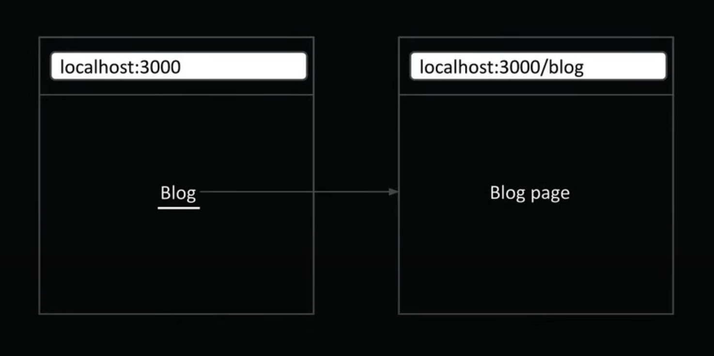
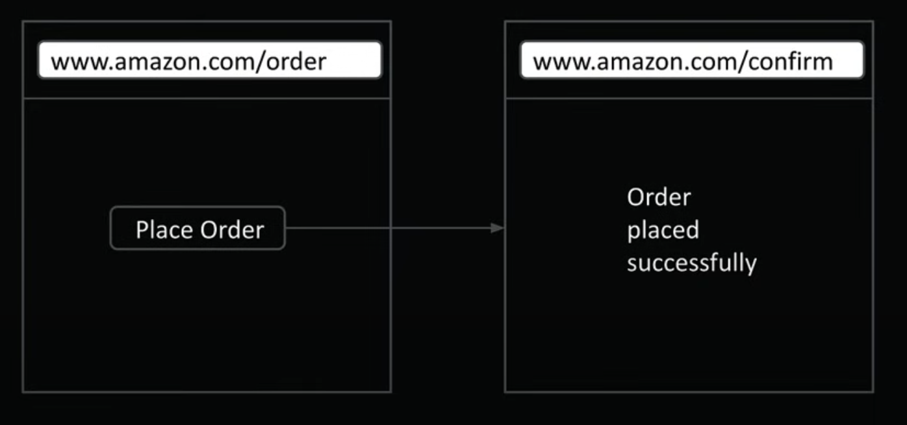
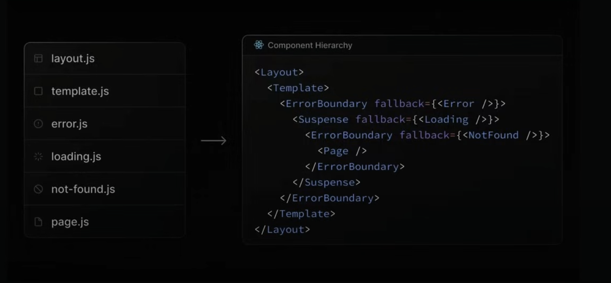
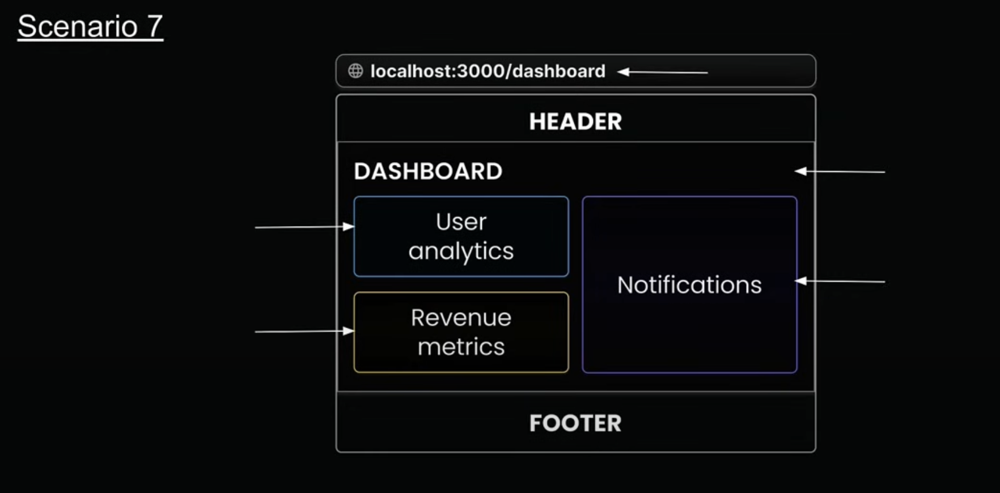
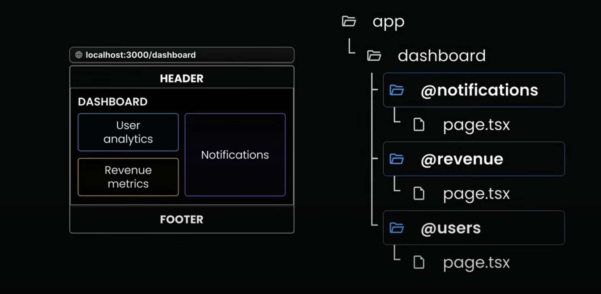
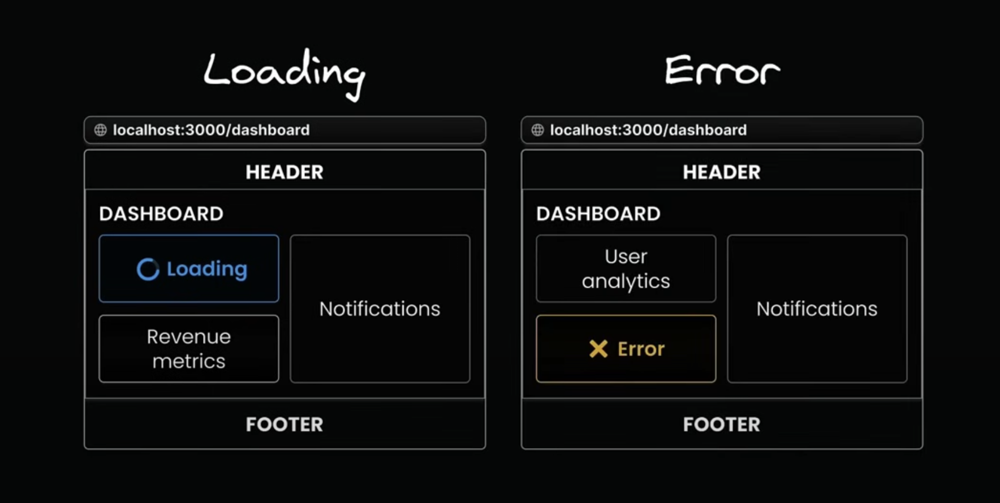
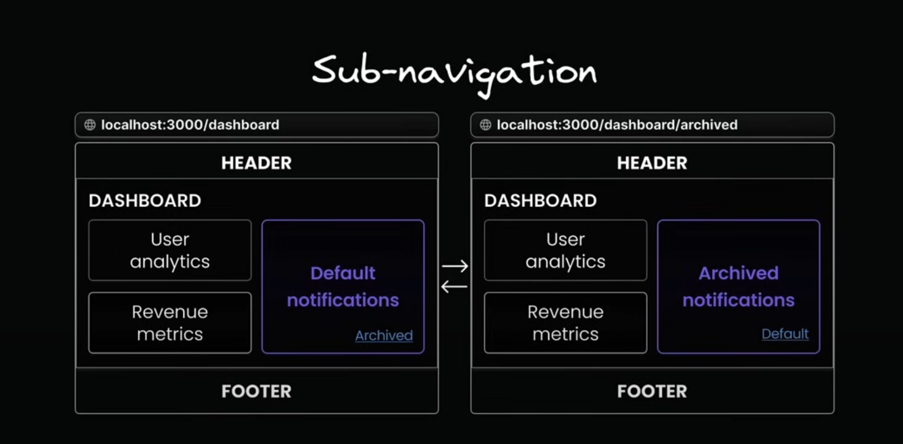

# Next-Js by Codevolution : Part-2

### Topics Covered : 

- Linking Component Navigation
- Active Links
- params and searchParams
- Navigating Programmatically
- Templates
- Loading UI
- Error Handling
- Recovering from Errors
- Handling Errors in Nested Routes
- Handling Errors in Layouts
- Handling Global Errors
- Parallel Routes
- Unmatched Routes
- Conditional Routes
- Intercepting Routes
- Parallel Intercepting Routes
- Route Handlers

### Navigation so far : 

- File based routing system.

- Defining routes for our application's root, nested routes, dynamic routes, and catch-all routes.

- We'e been using typical URL's directly in the browser to test these routes, but that's not how real users navigae the websites.

Users : 
    - Click on links
    - get redirected after certain actions

**UI Navigation :**



### Linking Component Navigation : 

- For cient-side navigation, Next.js gives us the `<Link>` component.

- The `<Link>` component is a React component that extends the HTML `<a>` element, and it's the primary way to navigate between routes in Next.js.

- To use it, we need to import it from "next/link".

**NOTE :** `replace` attribute in `<Link>` component overrides the current history entry, instead of adding a new one.

### Active Links : 

- We need Active links to highlight the current page we're on in the Navbar.

```js
"use client";

import Link from "next/link";
import { usePathname } from "next/navigation";

const navLinks = [
  { name: "Regster", href: "/register" },
  { name: "Login", href: "/login" },
  { name: "Forgot Password", href: "/forgot-password" },
];

export default function AuthLayoutLayout({
  children,
}: Readonly<{
  children: React.ReactNode;
}>) {
  const pathname = usePathname();

  return (
    <div className="space-y-7 mt-10">
      {navLinks.map((link) => {
        const isActive =
          pathname === link.href ||
          (pathname.startsWith(link.href) && link.href !== "/");

        return (
          <Link
            href={link.href}
            key={link.name}
            className={`text-lg mx-4 cursor-pointer p-2 rounded-lg ${
              isActive ? "bg-blue-700" : ""
            }`}
          >
            {link.name}
          </Link>
        );
      })}
      {children}
    </div>
  );
}
```

### params and searchParams : 

**For a given URL,**

- `params` is a promise that resolves into an object containing dynamic route parameters (like id).

- `searchParams` is a promise that resolves into an object containing query parameters (like filters and sorting).

**NOTE :**

- `params` and `searchParams` can be accessed inside a server component using async function and awaiting the `params` and `searchParams`.

- If you want to access the `params` and `searchParams` in a client component, use the "use" hook, which was introduces in react 19.

- While `page.tsx` has access to both params and searchParams, `layout.tsx` only has access to params.

### Navigating Programmatically : 



- We use `useRouter` hook from "next/navigation", to redirect the user programmatically.

- We can also use `redirect` from "next/navigation".

### Templates : 

- Templates are similar to layouts in that they are also UI shared between multiple pages in your app.

- Whenever a user navigates between routes sharing a template, you get a completely fresh start.

    - A new template component instance is mounted.
    - DOM elements are re-created.
    - States are cleared.
    - Effects are re-synchronized.

- Create a template by exporting aa default React component from a template.js or template.tsx file.

- Like layouts, templates needs to accept a children prop to render the nested route segment.

**DEMO :** 

- Inside the `(auth)/layout.tsx`, add an Input field and store the value entered in the input box inside a state variable.

- Now if you checkout the auth routes, you'll see an Input box.

- Type something in the input box and navigate to other pages by clicking the button below the input box.

- Then you'll notice that the value entered in the input box is persisted accross the navigation. 

- This happens because the layout only mounts new page content, while keeping the common elements intact. They don't re-mount the shared components, which leads to better performance.

- If you don't want the value to be persisted, all we need to do is, re-name the `(auth)/layout.tsx` file into `template.tsx`.

### Loading UI

**Special files :** `page.tsx`, `layout.tsx`, `template.tsx` and `not-found.tsx`.

- `Loading.tsx` is another special file used for loading states.

- This file helps us create loading states that users see while waiting for content to load in a specific route segment.

- The loading states appear instantly when navigating, letting users know that the application is responsive and actively loading content.

- Just create a file called as `loading.tsx` and export a React component called `Loading` which returns an `<h1>` laoding...

- Behind the scenes, Next.js automatically wraps `loading.tsx` file to the `page.tsx` file and it's nested children with in a react suspense boundary.

**Benefits of `loading.tsx` :**

1. It gives users immediate feedback when they navigate somewhere new. This makes your app feel snappy and responsive, and users know their click actually did something.

2. Next.js keeps shared layouts interactive while new content loads. Users can still use things like navigation menus or sidebars even if the main content isn't ready yet.

### Error Handling : 

**Special files :** `page.tsx`, `layout.tsx`, `template.tsx`,`not-found.tsx` and `Loading.tsx`.

- `Error.tsx` is another special file used for error handling.

- It automatically wraps route segments and their nested children in a React Error boundary.

- You can create custom error UIs for specific segments using the file-system hierarchy.

- It isolates errors to affected segments while keeping the rest of your app functional.

- It enables you to attempt to recover from an error without requiring a full page reload.

**Component Hierarchy :**



**Demo :**

```js
// Example for error handling
function getRandomInt(count: number) {
  return Math.floor(Math.random() * count);
}

export default async function ReviewDetails({
  params,
}: {
  params: Promise<{ productId: string; reviewId: string }>;
}) {
  const { productId, reviewId } = await params;
  const random = getRandomInt(2);

  if (random === 1) {
    throw new Error("Error loading review!!!");
  }

  return (
    <div className="flex flex-col justify-center items-center h-screen w-full">
      <h2 className="text-2xl">Details about the product</h2>
      <p>Product {productId}</p>
      <p>Review {reviewId}</p>
    </div>
  );
}
```

- Now if you visit the route `http://localhost:3000/products/9/reviews/2` and refresh mulitple times you'll see an Error.

- This Error will break our entire application in production. 

- We need to handle the Error gracefully by containing them to just the affected parts, while keeping the rest of our application running. 

- This can be achieved by creating a seperate file for error handling. 

**Different ways of writing error.tsx file :**

1. Without error props :
```js
"use client";

export default function ErrorBoundary() {
  return (
    <div className="flex flex-col justify-center items-center gap-4 h-screen w-full">
      <p className="text-2xl font-bold">Something went wrong.....!!!</p>
    </div>
  );
}
```

2. With error props : 
```js
"use client";

export default function ErrorBoundary({ error }: { error:Error }) {
  return (
    <div className="flex flex-col justify-center items-center gap-4 h-screen w-full">
      <p className="text-2xl font-bold">{error.message}</p>
    </div>
  );
}
```

**NOTE :** `error.tsx` file must always be a client component.

### Recovering from Errors : 

- Previously we studied about handling errors gracefully using `error.tsx`.

- While some errors are serious, others might be temporary and can be fixed with a simple retry.

```js
"use client";

import { useRouter } from "next/navigation";
import { startTransition } from "react";

export default function ErrorBoundary({
  error,
  reset,
}: {
  error: Error;
  reset: () => void;
}) {
  const router = useRouter();
  const reload = () => {
    startTransition(() => {
      router.refresh();
      reset();
    })
  };

  return (
    <div className="flex flex-col justify-center items-center gap-4 h-screen w-full">
      <p className="text-2xl font-bold">{error.message}</p>
      <button
        onClick={() => reload()}
        className="bg-white py-2 px-4 text-black font-bold rounded-[5px] cursor-pointer"
      >
        Try again
      </button>
    </div>
  );
}
```

- `Try again` button gives users a way to retry rendering the component in `page.tsx`.

- `reset()` method attempts to re-render client side. So converting `[reviewId]/page.tsx` into a client component would be a overkill.

- To attempt to server side recovery, we need to rely on `useRouter` and `startTransition` from react.

### Handling Errors in Nested Routes : 

- Errors always bubble up to find the closest parent error boundary.

- An `error.tsx` file handles errors not just for its own folder, but for all the nested child segments below it too

- By strategically placing `error.tsx` files at different levels in your route folders, you can control exactly how detailed your error handling gets.

- Where you put your `error.tsx` file makes a huge difference - it determines exactly which part of your UI get affected when things go wrong.

**DEMO :** Move the `error.tsx` file from `products/[productId]/reviews/[reviewId/error.tsx]`, to `products` folder and notice the difference. Then move the `error.tsx` file back to the `[reviewId]` folder. 

### Handling Errors in Layouts : 

- An `error.tsx` file will handle errors for all its nested child segments.

- There's an interesting catch with layout.tsx component in the same segment.

- The error boundary won't catch errors thrown in layout.tsx within the same segment because of how the component hierarchy works.

- The layout actually sits above the error boundary in the component tree.


### Handling Global Errors : 

- If an error boundary can't catch errors in the `layout.tsx` file from the same segment, what about errors in the root layout?

- It doesn't have a parent segment - how do we handle those errors?

- Next.js provides a special file called `global-error.tsx` that goes in your root app directory.

- This is your last line of defense when something goes catastrophically wrong at the highest level of your app.

  - Works only in production mode.
  - Requires html and body tags to be rendered

## Advanced Routing 

### Parallel routes : 

**What they are :**

- Parallel routing is an advanced routing mechanism that lets us render multiple pages simultaneously within the same layout.

**Scenario 7 :**


**How to set them up :**

- Parallel routes in Next.js are defined using a feature known as “slots”.

- Slots help organize content in a modular way.

- To create a slot, we use the @folder naming convention.

- Each defined slot automatically becomes a prop in its corresponding `layout.tsx` file.



**Parallel routes use cases :**

- Dashbaord with multiple sections.
- Split-view interfaces.
- Multi-pane layouts.
- Complex admin interfaces.
- Or any UI where sections needs to operate independently.

**Parallel routes benefits**

1. Parallel routes are great for splitting a layout into managable slots(especially when different teams work on different parts)

2. Independent route handling.

    - Each slot in your layout, such as users, revenue, and notifications, can handle its own loading and error states.

    - This granular control is particularly useful in scenarios where different sections of the page load at varying speeds or encounter unique errors.



3. Sub-navigation

    - Each slot can essentially function as a mini-application, complete with its own navigation and state management.

    - Users can interact with each section seperately, applying filters, sorting data or navigating through pages without affecting other parts.



### Unmatched Routes : 

**Navigation from the UI :**

- When navigating through the UI (like clicking links), Next.js keeps showing whatever was in the unmatched slots before

**Page reload :**

- Next.js looks for a default.tsx file in each unmatched slot

- This file is critical as it serves as a fallback to render content when the framework cannot retrieve a slot's active state from the current URL

- Without the file, you'll get a 404 error.

**NOTE :** `default.tsx` can mirror the content from `page.tsx` or show something completely different.

### Conditional Routes : 

- Imagine you want to show different content based on whether a user is logged in or not.

- You might want to display a dashboard for authenticated users but show a login page for those who aren't.

- Conditional routes allow us to achieve this while maintaining completely seperate code on the same URL.